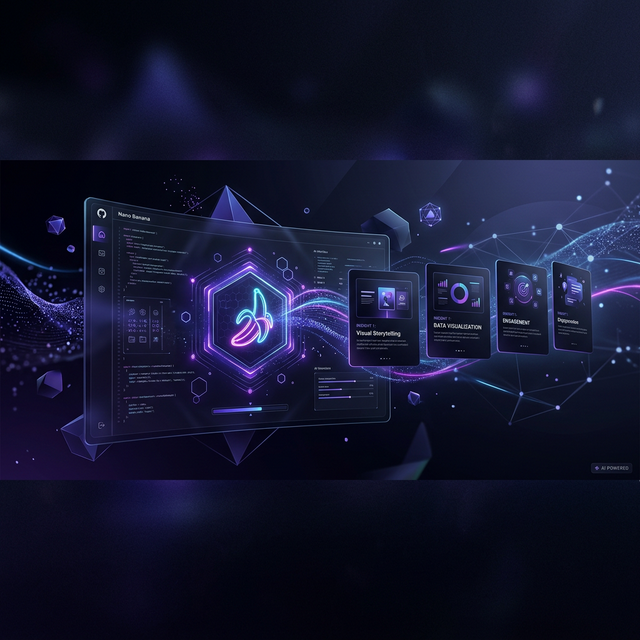

# 🍌 Nano Banana: The Elite AI Carousel Architect



> **"Turn thoughts into authority-building LinkedIn carousels in 60 seconds."**

Nano Banana is an ultra-premium, open-source AI engine designed for thought leaders, creators, and professionals who want to dominate LinkedIn without spending hours on design. Powered by **Gemini 2.0 Flash**, it handles everything from narrative arc creation to high-fidelity visual rendering.

---

## ✨ Features that Wow

*   **🧠 Intelligent Storytelling:** Generates a cohesive 5-step narrative arc based on your topic and tone.
*   **🎨 Bespoke Visuals:** Uses advanced multi-modal AI to render high-resolution slides with integrated typography.
*   **🌊 Fluid UX:** An ultra-modern, glassmorphic interface with smooth animations powered by Framer Motion.
*   **📄 One-Click Export:** Download your entire carousel as a professional PDF, ready for LinkedIn upload.
*   **✍️ Automated Engagement:** Generates a high-hook LinkedIn caption with relevant hashtags tailored to your carousel.
*   **🚀 Open Source & Extensible:** Built for the community. Connect your own API keys and customize the engine.

---

## 🛠️ Tech Stack (The Core)

*   **Frontend:** [React 19](https://react.dev/) + [TypeScript](https://www.typescriptlang.org/)
*   **Styling:** [Tailwind CSS](https://tailwindcss.com/) (The industry standard)
*   **Animations:** [Framer Motion](https://www.framer.com/motion/)
*   **AI Engine:** [Google Gemini 2.0 Flash](https://aistudio.google.com/)
*   **Icons:** [Lucide React](https://lucide.dev/)
*   **Build Tool:** [Vite](https://vitejs.dev/)

---

## 🚀 Getting Started (For Everyone)

Whether you're a developer or just want to use the tool, follow these simple steps:

### 1. Prerequisites
- [Node.js](https://nodejs.org/) (Version 18 or higher)
- A **Gemini API Key** (Get it for free at [Google AI Studio](https://aistudio.google.com/app/apikey))

### 2. Installation
```bash
# Clone the repository
git clone https://github.com/msk0442/AI-Carousel-Generator.git

# Navigate to the project folder
cd AI-Carousel-Generator

# Install dependencies
npm install
```

### 3. Connect Your API
Create a `.env` file in the root directory and add your API key:
```env
VITE_GEMINI_API_KEY=your_api_key_here
```
*(You can use `.env.example` as a template)*

### 4. Launch the App
```bash
npm run dev
```
Open [http://localhost:5173](http://localhost:5173) in your browser and start creating!

---

## 💡 How to Use Like a Pro

1.  **Select a Domain:** Choose from high-impact topics like "AI in Media" or "Future of Work".
2.  **Set the Resonance:** Pick a tone (Inspiring, Provocative, Technical) that matches your brand voice.
3.  **Architect:** Hit 'Launch Generator' and watch the AI synthesize your content in real-time.
4.  **Polish & Export:** Preview your slides, copy the engagement caption, and download the PDF.
5.  **Post:** Upload to LinkedIn as a "Document" to get that sweet carousel reach!

---

## 🤝 Contributing & Community

This project is 100% Open Source. We welcome all contributions!

1.  Fork the repo.
2.  Create your feature branch (`git checkout -b feature/AmazingFeature`).
3.  Commit your changes (`git commit -m 'Add some AmazingFeature'`).
4.  Push to the branch (`git push origin feature/AmazingFeature`).
5.  Open a Pull Request.

---

## 👨‍💻 Built by Muhammad Schees

Connect with me for more AI-driven solutions:
- **GitHub:** [@msk0442](https://github.com/msk0442)
- **LinkedIn:** [Muhammad Schees](https://www.linkedin.com/in/muhammadschees/)

---

<p align="center">
  Made with 🍌 and ❤️ by humans for humans.
</p>
